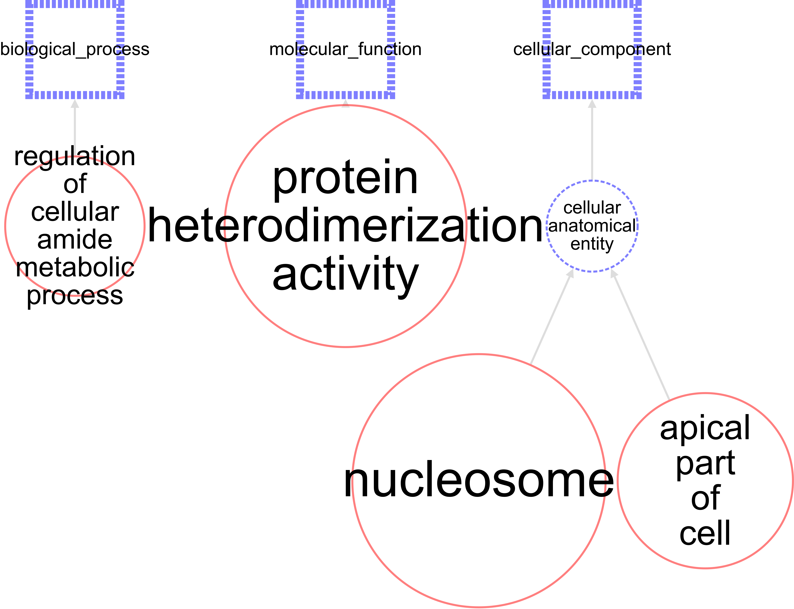
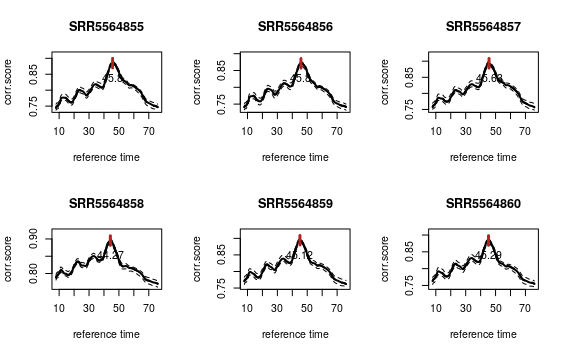
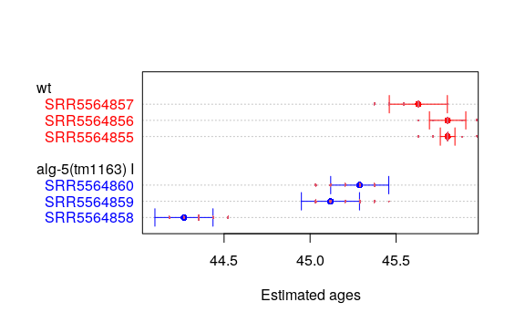
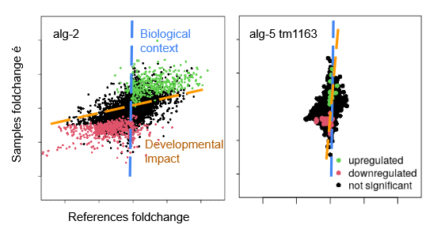

---
output:
  html_document: default
  pdf_document: default
---
# TP Next Generation Sequencing 2021 - Team RNAseq and modelisation

## Project presentation
Caenorhabditis elegans is a tiny, hermaphrodite nematode with a fixed number of somatic cells (cf. Figure 1). It is widely used as a model organism for fundamental research in a broad range of topics and notably in the study of small RNAs which are often implicated in RNA silencing mechanisms, and consequently have an
important role in the regulation of gene expression.
Argonautes proteins are known to interact with a subclass of small RNAs called microRNAs. 
Here, Brown and colleagues sequenced transcriptome of worms with defective argonautes proteins to study the effect of the mutations on gene expression. 

We will reproduce the transcriptomic analysis done by Brown et al. and use a cutting-edge tool developed in the lab (Bulteau and Francesconi (2021)) to assess the impact of developmental variation on the analysis of this dataset.

## Data presentation
Original article: Brown et al. 2017 Nucleic Acid Res.
DOI: 10.1093/nar/gkx536

Dataset is composed of 3 replicates of 5 strains (1 WT and 4 mutants alg-1(gk214), alg-2(ok304), alg-5 (tm1163) and alg-5(ram2))

All the high-throughput sequencing data are deposited in the Gene Expression Omnibus (GEO) and are available under accession number GSE98935.

Link : https://www.ncbi.nlm.nih.gov/Traces/study/?acc=PRJNA386876&o=acc_s%3Aa&s=SRR5564855,SRR5564856,SRR5564857

## Documentation

### Cloning git hub directory
`git clone https://github.com/Amauryk45/tp_nematode_2021.git`

### Launching master script
`~/mydatalocal/tp_nematode_2021/src/master_script.sh`

This script will launch the entire analysis. Steps are detailed below. 

### 1. Preparing utilities

`~/mydatalocal/tp_nematode_2021/src/initiation.sh`

This script will create the utilities directories that'll be used in the following analysis. 

### 2. Importing data 
1. Importing samples data
`~/mydatalocal/tp_nematode_2021/src/download_data.sh`

2. Importing C.elegans reference transcriptome
`~/mydatalocal/tp_nematode_2021/src/download_cDNA.sh`

Available at http://ftp.ensembl.org/pub/release-104/fasta/caenorhabditis_elegans/cdna/

### 3. Quality analysis:  Fastqc and Multiqc 
`~/mydatalocal/tp_nematode_2021/src/quality_data.sh`

The script takes two arguments:

- The input_dir of the files (e.g. "data/samples_data/")
- The suffix of the output directories (e.g. "raw").

It starts a set of analysis to check the quality of the data, including: 
- Basic statistics
- Per base sequence quality
- Per sequence quality score
- Per base sequence content
- Per base GC content
- Per sequence GC content
- Per base N content
- Sequence length distribution
- Sequence duplication level
- Overrepresented sequences
- Kmer content

### 4. Trimming the data
`~/mydatalocal/tp_nematode_2021/src/trimming_data.sh`

We will use Trimmomatic version 0.39 to filter the sequences. More info at http://www.usadellab.org/cms/?page=trimmomatic

Cleaning parameters have been chosen according to the results of the quality analysis : 

- Removal of adaptaters: ILLUMINACLIP:TruSeq3-PE.fa:2:30:10 
- LEADING:3 TRAILING:3 SLIDINGWINDOW:4:15 MINLEN:36

{ width=50% }

The script procedes to an other quality analysis (multiqc) after trimming the data. 

### 5. Transcript quantification
`~/mydatalocal/tp_nematode_2021/src/align_and_quantify.sh`

Indexation and quantification of transcripts using Salmon and its quasi-mapping technology.

More on Salmon: Patro, R., Duggal, G., Love, M. I., Irizarry, R. A., & Kingsford, C. (2017). Salmon provides fast and bias-aware quantification of transcript expression. Nature Methods.

The script procedes to an other quality analysis after mapping. 

### 6. Differential Expression (DE) analysis
`~/mydatalocal/tp_nematode_2021/src/dseq2_analysis.sh`

To look for different expressed genes between WT and mutants, we used DESeq2 whi is based on a model using the negative binomial distribution.

More on DESeq2: Love, M.I., Huber, W., Anders, S. (2014) Moderated estimation of fold change and dispersion for RNA-seq data with DESeq2. Genome Biology, 15:550. 10.1186/s13059-014-0550-8

The Wald test is used for the DESeq2 analysis. 

Differently regulated genes are defined after the following parameters:

- Up-regulated: p-value adjusted < 0,05 and log2 of the FoldChange > 1
 => 13 genes found for alg-5(tm1169) mutant
- Down-regulated: p-value adjusted < 0,05 and log2 of the FoldChange < -1
 => 38 genes found for alg-5(tm1169) mutant

### 7. Enrichment analyis
`~/mydatalocal/tp_nematode_2021/src/differential_analysis.R`

Location and function of differentially expressed genes is analysed using the WormBase "Enrichment Analysis" tool:https://wormbase.org/tools/enrichment/tea/tea.cgi

Results: 
Up-regulated genes in the alg-5(tm1169) mutant 
{ width=50% }

Down-regulated genes in the alg-5(tm1169) mutant
{ width=50% }

### 8. Evaluating the impact of development using RAPToR
`~/mydatalocal/tp_nematode_2021/src/RAPToR_analysis.R`

We used RAPTor to estimate the developmental time (which could differ from its chronological time) of the samples.As the authors used young adult worms, we chose the Cel_larv_YA reference transcriptome which encompass stages from larva to adults.

More on RAPToR:  Real age prediction from the transcriptome with RAPToR. Romain Bulteau, Mirko Francesconi
bioRxiv 2021.09.07.459270; doi: https://doi.org/10.1101/2021.09.07.459270  

We then estimate the developmental impact of the alg mutations when compared to the WT. 

alg-5(tm1169) mutant worms present a small developmental defect when compared to WT worms.*

We define two functions, getrefTP and refCompare, to compare control and  test samples using references changes (developmental) and observed changes. Results of alg-2 and alg-5 are plotted below. 

While there is no clear developmental defect in alg-5 mutants (seen by the vertical line indicating the developmental impact of the mutation), alg-2 (and alg-1, not shown) mutants presents a bias transcriptional pattern during development. Results from other mutants show that it consists of a retarded development. Taking these developmental differently expressed genes into account allows to isolate other genes that are not due to developmental defects. Thus, these isolated genes would be of greater biological interest when studying the mutation, as they could be direct targets of the Argonautes proteins. 

To conclude, this study is an other proof that real age prediction technologies can be efficiently used to estimate how mutations impact the transcriptome. This technology presents as well many applications  to increase to comparability of similar samples by aligning their developmental age. 
